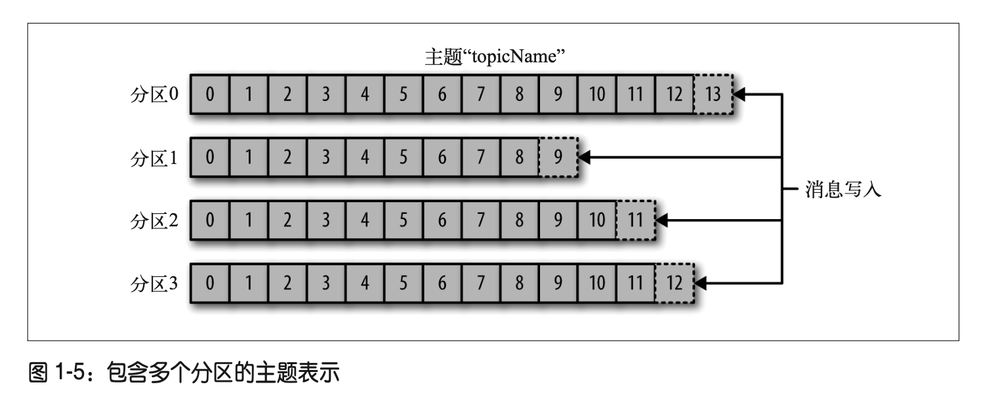
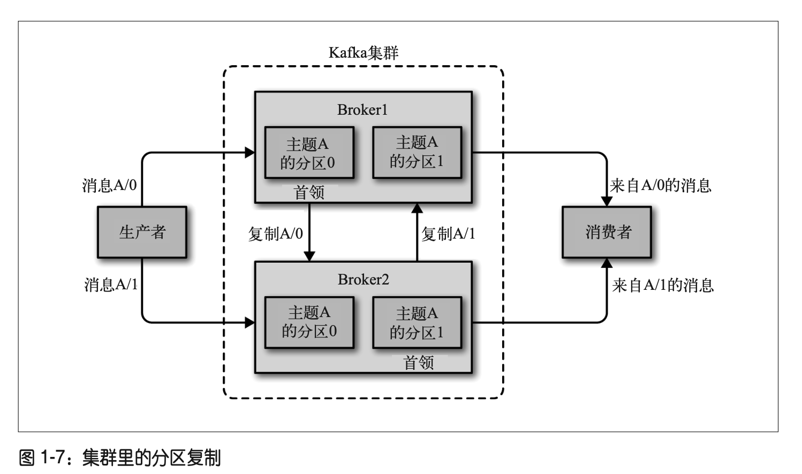

## 基本概念

### 消息和批次

- kafka的消息由字节组成，消息里面的数据没有特别的格式或者含义。
- 效益可以有一个可选的元数据——key（键），用于为消息选择分区。
- kafka消息是分批次写入的kafka，这些消息属于用一个主题或者分区。

### 主题和分区

- kafka消息通过主题进行分类，一个主题可以分为多个分区，同一个主题的不同分区可以分布在不同的服务器上。消息以FIFO的方式写入分区，以FIFO的方式读取。

### 生产者和消费者

- 生产者：发布一个消息到特定的主题上，但不关心特定消息会被写到那个分区上。

- 消费者：消费者订阅一个或多个主题，并按照消息生成的顺序读取他们。并通过一种元数据——偏移量来区分已经读取过的消息。

- 消费者群组：共同读取同一个主题的消费者构成一个消费者群组。群组保证每个分区只能被一个消费者使用。如下图所示：

  

### broker和集群

- broker：一个独立的Kafka服务器被称为broker。broke接收来自生产者的消息，为消息设置偏移量，并提交消息到磁盘保存。

- 集群控制器：broker是集群的组成部分，每个集群都会选举出一个活跃的broker充当集群控制器的角色，该控制器负责管理工作。

- 首领：一个分区从属于一个broker，一个分区可以分配给多个broker。

  

- 保留消息策略：kafka会将消息保留一段时间或者一定大小的字节数，当超过这个限制时，旧消息会过期并被删除。每个主题可以设置单独的保留策略。

### kafaka的优点

- 支持多个生产者、消费者
- 基于磁盘的数据存储，允许消费者非实时地读取消息
- 伸缩性，可以在线拓展集群
- 高性能，提供亚秒级的消息延迟

### kafka应用场景

- 活动跟踪——跟踪网站的用户活动，为机器学习系统提供数据
- 传递消息
- 度量指标和日志记录
- 提交日志
- 流处理

