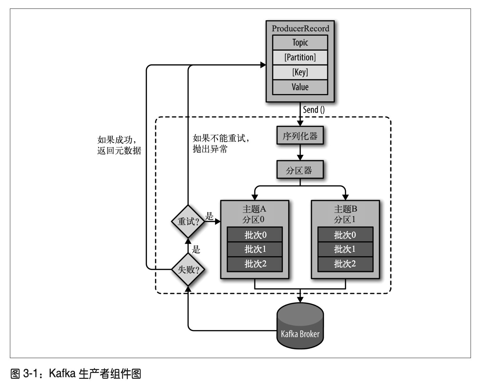

### kafka第三方客户端

第三方客户端通过直接向Kafka网络端口发送适当的字节序列以实现从Kafka读取消息或者写入消息。

### 构建kafka生产者

- 确定包含的目标topic和发送内容

- 指定键或分区（可选）

- 指定key和value的序列化器

- 发送消息

  

#### 生产者的属性

- 必选属性
  - `bootstrap.servers`：指定broker的address，格式为host：post
  - `key.serializer`:一个类用于序列化key
  - `value.serializer`:一个类用于序列化value

- 其他属性

  - `acks`: 指定必须有多少个副本收到消息才会认为消息写入成功。

    - acks=0表示不等待来自服务器的响应，能够支持最大速度发送消息，吞吐亮高。
    - acks=1表示收到首领节点的消息便认为消息写入成功。
    - acks=all表示收到参与复制的全部节点的消息时才认为消息发送成功，这个模式最安全但延迟高。

  - `buffer.memory`:该参数用来设置生产者内存缓冲区的大小，生产者用它缓冲要发送到服务器的消息。如果应用程序发送消息的速度超过发送到服务器的速度，会导致生产者空间不足。

  - ` compression.type`:默认情况下，消息发送时不会被压缩。该参数可以设置为 snappy、gzip 或 lz4，它指定了

    消息被发送给 broker 之前使用哪一种压缩算法进行压缩。

  - `retries`: 生产者从服务器收到的错误有可能是临时性的错误（比如分区找不到首领）。在这种情况下，retries 参数的值决定了生产者可以重发消息的次数，如果达到这个次数，生产者会放弃重试并返回错误。

  - ` batch.size`: 当有多个消息需要被发送到同一个分区时，生产者会把它们放在同一个批次里。该参数指定了一个批次可以使用的内存大小，按照字节数计算（而不是消息个数）。当批次被填满，批次里的所有消息会被发送出去。不过生产者并不一定都会等到批次被填满才发送，半满

    的批次，甚至只包含一个消息的批次也有可能被发送。

  - `linger.ms`: 该参数指定了生产者在发送批次之前等待更多消息加入批次的时间。KafkaProducer 会在批次填满或 linger.ms 达到上限时把批次发送出去。默认情况下，只要有可用的线程，生产者就会把消息发送出去，就算批次里只有一个消息。

  - `client.id`:字符串类型，用于标识client

  - `max.in.flight.requests.per.connection`:该参数指定了生产者在收到服务器响应之前可以发送多少个消息。它的值越高，就会占用越多的内存，不过也会提升吞吐量。

  - ` timeout.ms、request.timeout.ms 和 metadata.fetch.timeout.ms`:request.timeout.ms 指定了生产者在发送数据时等待服务器返回响应的时间，metadata.fetch.timeout.ms 指定了生产者在获取元数据（比如目标分区的首领是谁）时等待服务器返回响应的时间。如果等待响应超时，那么生产者要么重试发送数据，要么返回一个错误（抛出异常或执行回调）。timeout.ms 指定了 broker 等待同步副本返回消息确认的时间，与

    asks 的配置相匹配——如果在指定时间内没有收到同步副本的确认，那么 broker 就会返回一个错误。

  - `client.id`:该参数指定了在调用 send() 方法或使用 partitionsFor() 方法获取元数据时生产者的阻塞时间。当生产者的发送缓冲区已满，或者没有可用的元数据时，这些方法就会阻塞。在阻塞时间达到 max.block.ms 时，生产者会抛出超时异常。

  - `max.request.size`:该参数用于控制生产者发送的请求大小。它可以指能发送的单个消息的最大值，也可以指

    单个请求里所有消息总的大小。

  - `receive.buffer.bytes 和 send.buffer.bytes`:这两个参数分别指定了 TCP socket 接收和发送数据包的缓冲区大小。如果它们被设为-1，

    就使用操作系统的默认值。

#### 生产者发送消息的方式

- 发送并忘记（fire-and-forget）：不关心消息是否能够正常到达broker
- 同步发送：调用get()方法进行等待方法返回
- 异步发送：指定回调函数在响应返回时调用

#### 消息序列化

- 使用已有的序列化器和反序列化器（JSON，Avro，Thrift，Protobuf）
- 使用Avro进行序列化
  - 我们把所有写入数据需要用到的 schema 保存在注册表里，然后在记录里引用 schema 的标识符。负责读取数据的应用程序使用标识符从注册表里拉取 schema 来反序列化记录。序列化器和反序列化器分别负责处理 schema 的注册和拉取。

#### 消息格式

一条Kafka消息应该包含以下内容：

- 目标主题
- 键（可以为空）：可以用来作为消息的附加信息，也可以用来决定消息被写到主题的那个分区。拥有相同键的消息将被写到同一个分区。如果键值为 null，并且使用了默认的分区器，那么记录将被随机地发送到主题内各个可用的分区上。分区器使用轮询（Round Robin）算法将消息均衡地分布到各个分区上。[*注意*：只有在不改变主题分区数量的情况下，键与分区之间的映射才能保持不变。]
- 值

