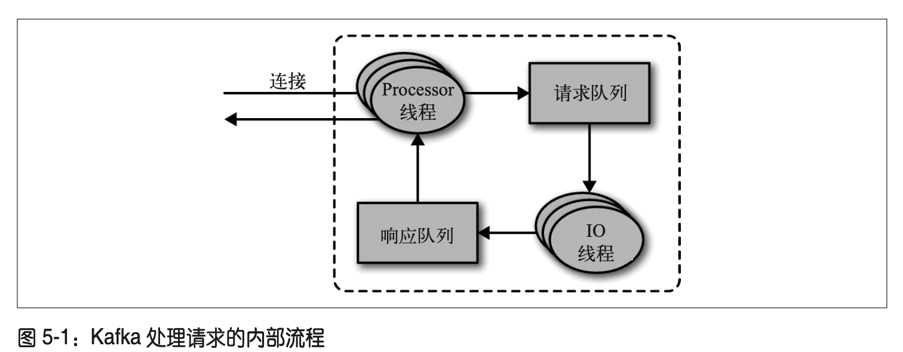
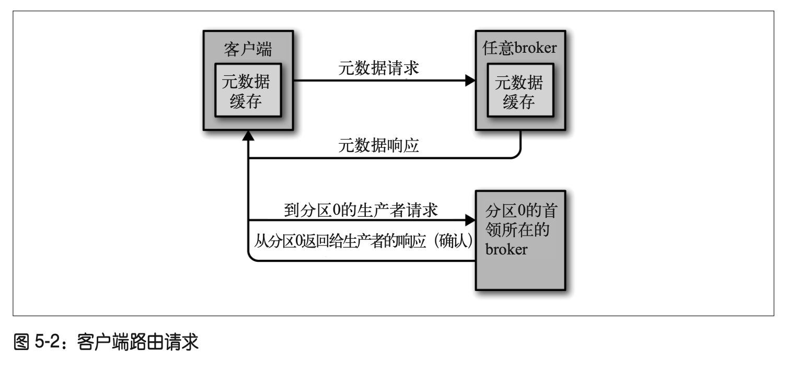

## 深入Kafka

### 控制器

控制器其实就是一个 broker，只不过它除了具有一般 broker 的功能之外，还负责分区首领的选举。集群里第一个启动的 broker 通过在Zookeeper 里创建一个临时节点 /controller 让自己成为控制器。其他 broker 在启动时也会尝试创建这个节点，不过它们会收到一个“节点已存在”的异常，然后“意识”到控制器节点已存在，也就是说集群里已经有一个控制器了。

### 复制

Kafka 使用主题来组织数据，每个主题被分为若干个分区，每个分区有多个副本。那些副本被保存在 broker 上，每个 broker 可以保存成百上千个属于不同主题和分区的副本。

- 首领副本（leader）：每个分区都有一个首领副本。为了保证一致性，所有生产者请求和消费者请求都会经过这个副本。
- 跟随者副本（follower）：首领以外的副本都是跟随者副本。跟随者副本不处理来自客户端的请求，它们唯一的任务就是从首领那里复制消息，保持与首领一致的状态。如果首领发生崩溃，其中的一个跟随者会被提升为新首领。
- 首选首领：创建主题时选定的首领就是分区的首选首领。之所以把它叫作首选首领，是因为在创建分区时，需要在 broker 之间均衡首。

### broker请求

broker 的大部分工作是处理客户端、分区副本和控制器发送给分区首领的请求。broker通过TCP协议来传输请求。broker 会在它所监听的每一个端口上运行一个 Acceptor 线程，这个线程会创建一个连接，并把它交给 Processor 线程去处理。Processor 线程（也被叫作“网络线程”）的数量是可配置的。网络线程负责从客户端获取请求消息，把它们放进请求队列，然后从响应队列获取响应消息，把它们发送给客户端。**所有的请求由首领副本处理**。如果 broker 收到一个针对特定分区的请求，而该分区的首领在另一个 broker 上，那么发送请求的客户端会收到一个“非分区首领”的错误响应。当针对特定分区的获取请求被发送到一个不含有该分区首领的 broker上，也会出现同样的错误。Kafka 客户端要自己负责把生产请求和获取请求发送到正确的broker 上。

#### 请求格式

- Request type
- Request version
- Correlation ID：个具有唯一性的数字，用于标识请求消息，同时也会出现在响应消息和错误日志里（用于诊断问题）
- Client ID

#### 请求类型

- 生产请求：生产者发送的请求
- 获取请求：消费者或者follower副本发送的请求
- 元数据请求：获取首领broker信息

#### 元数据请求

为获取正确的首领broker，客户端需要发送**元数据请求**来获取分区的首领broker。这种请求包含了客户端感兴趣的主题列表。服务器端的响应消息里指明了这些主题所包含的分区、每个分区都有哪些副本，以及哪个副本是首领。元数据请求可以发送给任意一个 broker，因为所有 broker 都缓存了这些信息。

### 物理存储

Kafka 的基本存储单元是分区。分区无法在多个 broker 间进行再细分，也无法在同一个broker 的多个磁盘上进行再细分。

