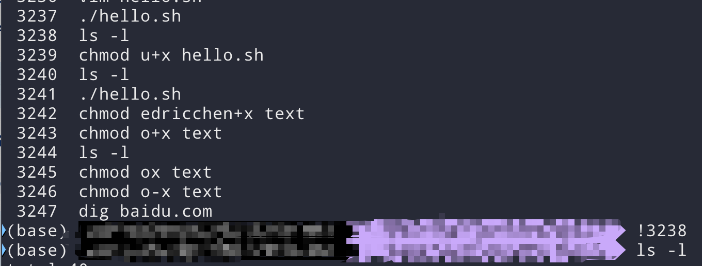

#### curl命令

`curl` 是一个用于在命令行中进行数据传输的工具，支持多种协议（如 HTTP、HTTPS、FTP 等）。它广泛用于测试和调试网络连接、下载文件、与 API 交互等。以下是一些常见的 `curl` 命令示例和用法：

```shell
curl https://example.com # get方式请求数据
curl -X post --data 'param=value' https://example.com/ # post方式请求数据
curl -X post -H "Content-Type:application/json" -d '{"key1":"value1","key1":"value1"}' http://example.com # json 方式请求数据
```

#### ls命令

`ls` 用于展示文件夹中的内容

```shell
ls # List files 
ls -l # list files one per line
ls -a # list all files,including hidden files
ls -f # list all files,with trailing / added to directory names(在目录文件名后面添加'\')
ls -la 
ls -lh # long format list with size displayed using human-readable units
ls -lSR # long format list sorted by size recursively
ls -ltr # long format list of all files,sorted by modificaiton date
ls -d */ # only list directories
```

#### tail命令

`tail` 用于展示文件后面的一部分内容

```shell
tail -n count path/to/file  # show last 'count' line in file
tail -n +count path/to/file  # show file content from a specific line
tail -c count path/to/file # show a specific count of bytes from the end of a given file
tail -f path/to/file # keep reading file util crtl + c
```

#### cat命令

`cat` 用于输出以及链接文件内容

```shell
cat path/to/file # show the content of a file
cat path/to/file path/to/file2 ...> path/to/output_file # concatenate several files into an output file(overwrite the content of the output_file)
cat path/to/file path/to/file2 ...>> path/to/output_file # concatenate several files into an output file(append the content of source file to the end of the output_file)
cat -u file1 > file2 # copy the contents of file1 to file2（'>' means overwrite,'>>' means append to end of target file）
cat - > path/to/file # write stdin to a file
```

#### grep命令

`grep`用于按照正则表达式搜索文件内容

```shell
grep "search_pattern" path/to/file # search for a pattern within a file
grep -F|--fixed-strings "exact_string" path/to/file # search for an exact string(disabled regular expressions)
grep -v|--invert-match "search_pattern" # search do not match pattern
```

#### ps命令

`ps`用于展示running processes的信息

```shell
ps aux ｜ -ef # list all processes
ps -ef | grep string # search a process that matches a string
```

#### env命令

`env`用于查看以及设置环境变量

```shell
env # show the environment variable
env variable=value # set a variable
env -u variable # remove a variable
```

#### top命令

`top`用于查看running processes的动态实时信息

```shell
top # start top
```

#### netstat命令

`netstat`是一个网络统计工具，用于显示与网络相关的各种信息

```shell
netstat 
```

#### df命令

`df`用于显示文件系统的磁盘空间使用情况

```shell
df # display all usage of filesystem
df -h # display all usage of filesystem(human readable)
```

#### lsof命令

`lsof`用于列出当前系统中所有打开的文件

```shell
lsof # show all opened files,include socket,pipe,device files
lsof -u username # show opened files of this username
```

#### du命令

`du`用于展示文件占用磁盘空间的量

```shell
du -h path/to/directory # list the size of a directory and any subdirectories
```

#### id命令

`id`用于显示user和group信息

```shell
id # show current user info
id username# show specifc user info
```

#### chown命令

`chown`用于更改文件的所属用户

```shell
chown user path/to/file
chown user:group path/to/file
```

#### chmod命令

`chmod`用于更改文件的访问权限

```shell
# - rwx r-- r--
# 第一个字符表示文件类型 '-' 表示普通文件 'd' 表示目录 'l'表示符号链接 's'表示套接字 'p'表示命名管道
# 接下来的9个字符分为3组，每组3个字符，分别表示owner，group，other的权限
# ---------------------
# 权限类型
# r 表示 读权限
# w 表示 写权限
# x 表示 执行权限
# - 表示 无权限
# ---------------------
# 操作符
# + 表示增加权限
# - 表示删除权限
# = 表示设置权限
# ----------------------
# 符号表示法
# u 表示 user
# g 表示 group
# o 表示 others
# a 表示 all
# ---------------------
# 同样也可以使用8进制来表示权限
# 1表示执行权限
# 2表示写权限
# 4表示读权限
# 因此上面的文件权限可以表示成
# -744

chmod u+x  # give the user who owns a file the right to execute it 
chmod u-x  # remove the user whoe owns a file the right to execute it 
```

#### dig

`dig`命令用于dns查询

``` shell
dig example.com
```

#### history

```history```用于查看shell历史命令

```shell
history # lookup all commands list history with line numbers
history 20 # show the last 20 commands
# 如果你不想重新输入过去的命令，可以在命令行号前添加!+line number

```



#### su命令

`su`用于切换用户

```shell
su # switch to superuser
su username # switch to speical user
su - username - C "command" # execute a command as another user
```

#### tcpdump

`tcpdump`用于网络包抓取

```shell
sudo tcpdump -i eth0 host ipv4 -X # capture the traffic of a specific interface and a host with Ascii format
sudo tcpdump -i eth0 src host port 80 -X # capture the traffic of a specific interface,source host 
sudo tcpdump -i eth0 dst host port 80 -X # capture the traffic of a specific interface,source host 
```

