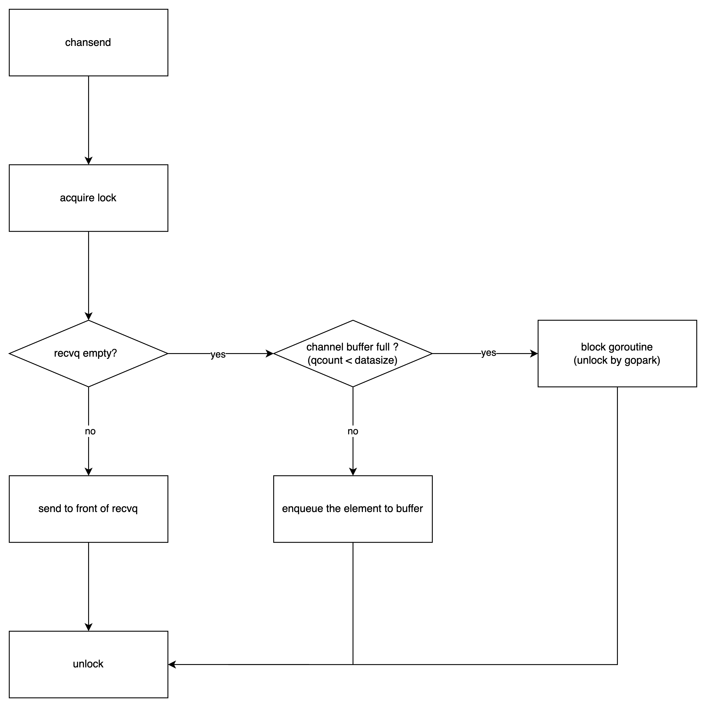
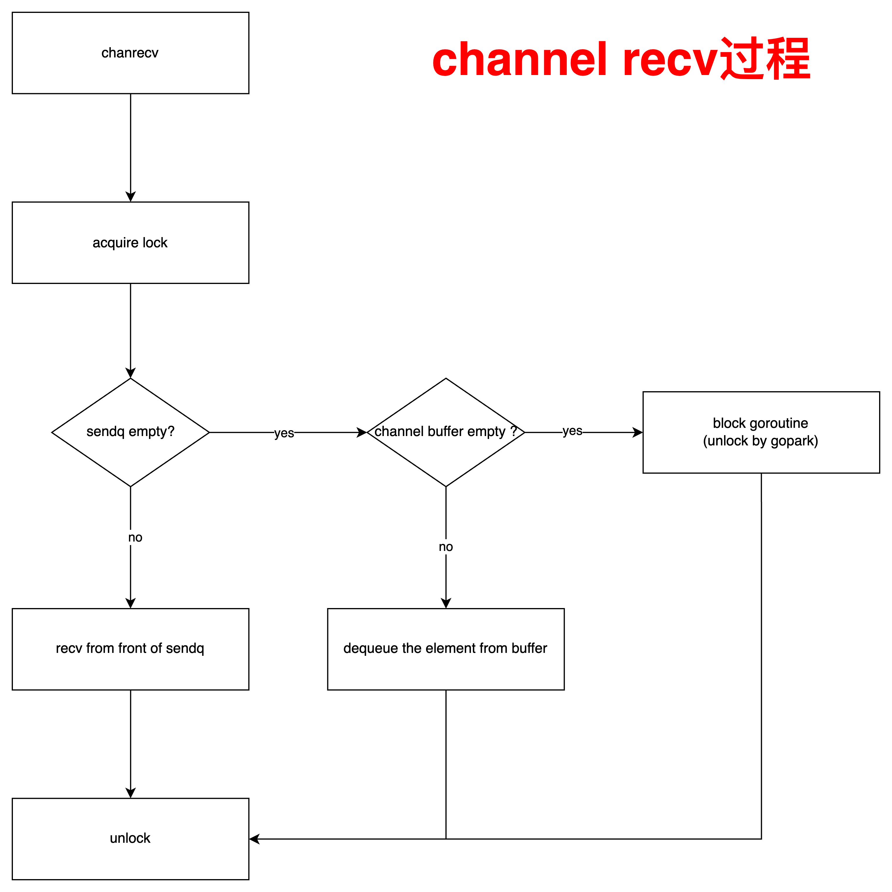

**源码**：https://cs.opensource.google/go/go/+/refs/tags/go1.23.2:src/runtime/chan.go

#### channel内部结构

``` go
type hchan struct {
	qcount   uint           // total data in the queue
	dataqsiz uint           // size of the circular queue
	buf      unsafe.Pointer // points to an array of dataqsiz elements
	elemsize uint16
	closed   uint32
	timer    *timer // timer feeding this chan
	elemtype *_type // element type
	sendx    uint   // send index
	recvx    uint   // receive index
	recvq    waitq  // list of recv waiters
	sendq    waitq  // list of send waiters

	// lock protects all fields in hchan, as well as several
	// fields in sudogs blocked on this channel.
	//
	// Do not change another G's status while holding this lock
	// (in particular, do not ready a G), as this can deadlock
	// with stack shrinking.
	lock mutex
}
```

- qcount : 表示当前队列中存储了多少个元素
- dataqsiz：表示环形队列的大小（队列的最大容量）
- buf：指向环形队列所在内存的起始位置
- elemsize：每个元素占用多少字节
- closed：表示当前channel是否close掉
- sendx：发送队列索引（循环队列队尾）
- recvx：接收队列索引（循环队列队头）
- recvq：一个goroutine接收者队列，链表存储
- sendq：一个goroutine发送者队列，链表存储

- lock：锁

#### send过程

向channel发送的数据的过程如下：

- 首先获取lock，防止多个goroutine同时操作该hchan；
- 接着判断recvq是否为空；
- 若recvq不为空，说明存在等待接收的goroutine；直接将要发送的数据发送给队头的goroutine处理；
- 若recvq为空，判断channel buf是否已满；
- 若buffer不为满，将要发送的数据储存到环形buffer中；
- 若buffer为满，则阻塞该goroutine，$$\color{red}\textbf{并通过gopark释放lock，以便其他goroutine操作}$$



#### recv过程

从channel接收的数据的过程如下：

- 首先获取lock，防止多个goroutine同时操作该hchan；
- 接着判断sendq是否为空；
- 若sendq不为空，说明存在等待发送的goroutine；直接从队头的goroutine中获取数据；
- 若sendq为空，判断channel buf是否已满；
- 若buffer不为满，从环形buffer中读取数据；
- 若buffer为满，则阻塞该goroutine，$$\color{red}\textbf{并通过gopark释放lock，以便其他goroutine操作}$$

